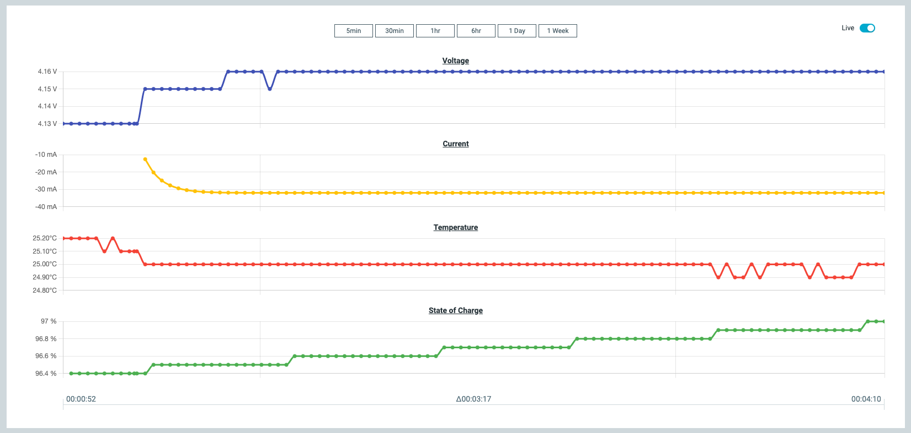

# Evaluating a battery model with nPM PowerUP

To start fuel gauge evaluations using a battery model, complete the following steps:

1. Connect a battery to the EK.
1. Enable the **Fuel Gauge** setting on the [**Dashboard**](./overview.md#dashboard-tab) tab.
1. If you are using nPM1300 EK or nPM1304 EK, select the battery model for evaluation in the [**Fuel Gauge**](./overview.md#npm1300-and-nPM1304-fuel-gauge) side panel. 
   Use one of the following options:

    * Use the **Active Battery Model** for a preloaded battery model
    * Add a custom battery model by completing the following steps:

        1. Select [**Add New Active Battery Model**](./overview.md#npm1300-and-nPM1304-fuel-gauge) in the side panel. 
          A drop-down menu appears.
        1. Select **Custom Model** to load the generated JSON battery model file to the host System on Chip (SoC) of the PMIC EK.

1. Open the [**Graph**](./overview.md#graph-tab) tab.
1. Make sure the **Live** toggle is enabled. 
   The graph will display the live State of Charge over time.

    
