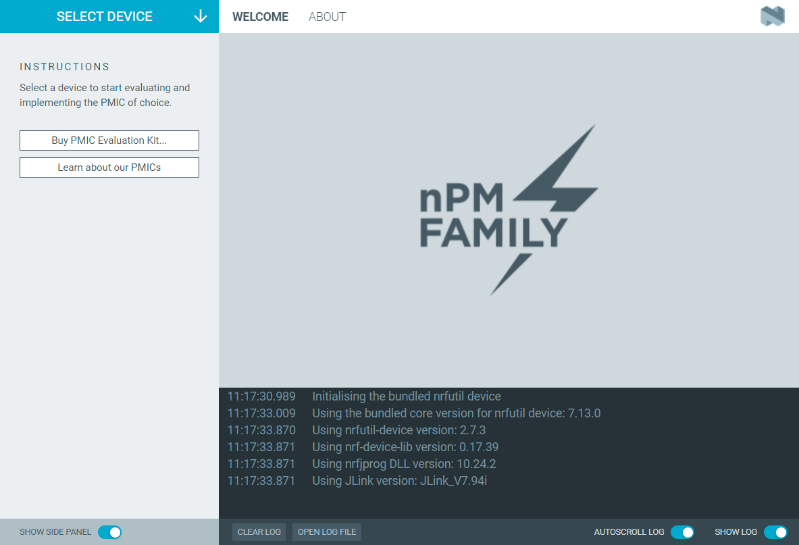
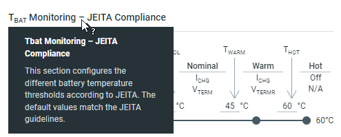
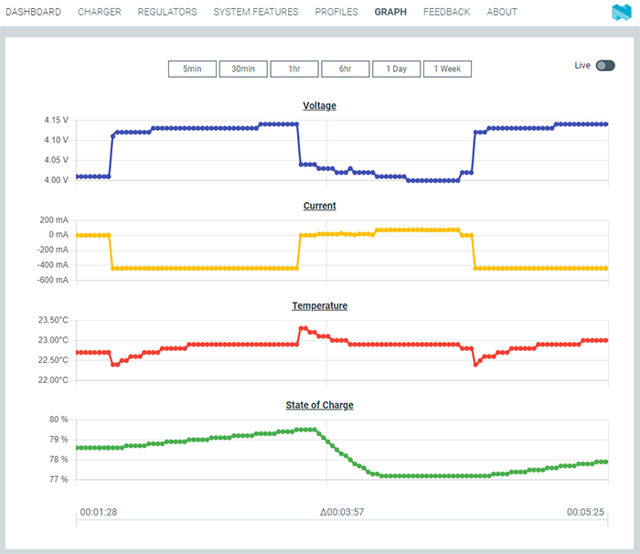

# Overview and user interface

After starting nPM PowerUP, the main application window is displayed.

The available options and information change after you **Select Device**.

!!! info "tip"
      This page provides only a general overview of the application UI. For detailed information about each option, see its tooltip.

       

## Before selection

Before a device is selected, the side panel contains the following buttons:

### Select Device

Dropdown to list the PMIC devices attached to the computer.

!!! note "Note"
      Read [Connect the nPM1300 EK with nPM PowerUP](https://docs.nordicsemi.com/bundle/ug_npm1300_ek/page/UG/nPM1300_EK/use_ek_power_up.html) for information about the hardware setup required to use the nPM1300 EK with nPM PowerUP.

## After selection

When a device is selected, the side panel options become available.

### Actions

This side panel area contains the following buttons:

|          Button          | Purpose |
| ------------------------ | ------- |
| **Export Configuration** | Purpose |
| **Load Configuration**   | Purpose |
| **Open Serial Terminal** | Opens the [nRF Connect Serial Terminal](https://docs.nordicsemi.com/bundle/nrf-connect-serial-terminal/page/index.html) application in a separate window. Make sure to first [install the application](). |
| **Reset Device**         | Purpose |
| **Record Events**        | Purpose |

### Fuel Gauge

This side panel area lets you select the following options:

- **Active Battery Model** -
- **Add New Active Battery Model** -

### Settings

This side panel area lets you configure the reporting rate.

### Connection Status

## Dashboard tab

The **Dashboard** tab provides a quick look overview of the major PMIC settings from the **Charger** and **Regulators** tabs.

## Charger tab

You can use the options in the **Charger** tab to control and monitor the charging settings and status of the PMIC device.

Using the built-in battery models, you can get an estimated time-to-full and time-to-empty when charging or discharging a battery connected to the EK.

## Regulators tab

You can use the options in the **Regulatros** tab to enable or disable specific voltage regulators (like **BUCK** or **LDO**).

Here you can also set the output and retention voltage for each regulator and monitor its status.

## GPIOs tab

You can use the options in the **GPIOs** tab to configure the GPIO pins available on the PMIC device.

## System Features tab

You can use the options in the **System Features** tab to configure the **Reset and Low Power control**, **Timer**, **Power Failure**, **Vbus input current limiter**, and **Reset & Error Logs**.

## Profiles tab

To make changes to the generated battery model, upload the projects in the PROFILES tab of the nPM PowerUP app. You can then make edits, merge individual temperature profiles, or change the configuration settings of the generated battery model.
Note: The battery model is automatically stored as .json and .inc file formats. Use the .json file for evaluations in nPM PowerUP and the .inc file when integrating the battery model to your final application with a Nordic System on Chip (SoC). Refer also to nPM1300 fuel gauge application samples.

## Graph tab

After generating the battery model, you can use the GRAPH tab in the nPM PowerUP app to evaluate the battery state-of-charge predictions in real time. Make sure the battery fuel gauge on the DASHBOARD tab is enabled.

## Log

The Log panel allows you to view the most important log events, tagged with a timestamp. Each time you open the app, a new session log file is created. You can find the Log panel and its controls, below the main application Window.

- When troubleshooting, to view more detailed information than shown in the Log panel, use **Open log file** to open the current log file in a text editor.
- To clear the information currently displayed in the Log panel, use **Clear Log**. The contents of the log file are not affected.
- To hide or display the Log panel in the user interface, use **Show Log**.
- To freeze Log panel scrolling, use **Autoscroll Log**.

## About tab

You can view application information, restore defaults, access source code and documentation. You also can find information on the selected device, access support tools, send feedback, and enable verbose logging.