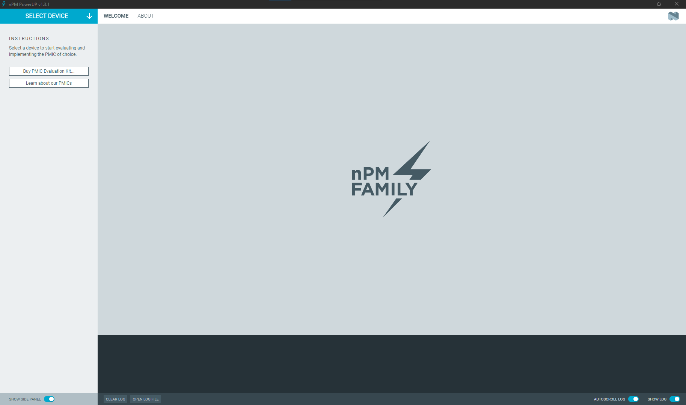
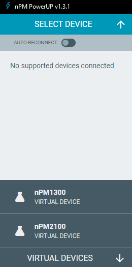
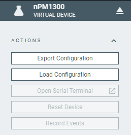
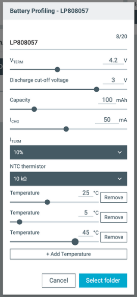
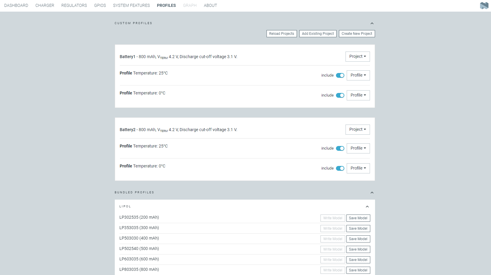
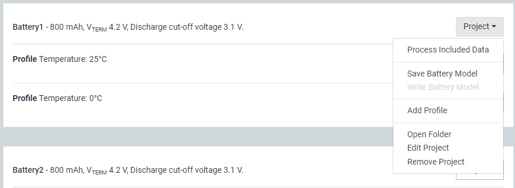
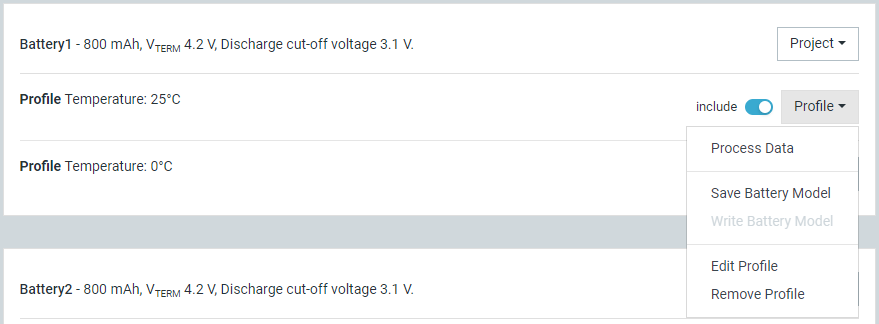

# Overview and user interface

After starting the nPM PowerUP app, the main application window is displayed.

!!! info "Tip"
      This page provides only a general overview of the application UI. For detailed information, see each option's tooltip.

       

## Before selection

Before a device is selected, you can use the links in the **Instructions** to [buy a PMIC Evaluation Kit](https://www.nordicsemi.com/About-us/BuyOnline) or [read more about PMIC products from Nordic Semiconductor](https://www.nordicsemi.com/Products/Power-Management-ICs).

The available options and information change after you **Select Device**.

### Select Device

Dropdown to list the PMIC devices attached to the computer.

!!! note "Note"
      If you are using the nPM1300 EK, read [Connect the nPM1300 EK with nPM PowerUP](https://docs.nordicsemi.com/bundle/ug_npm1300_ek/page/UG/nPM1300_EK/use_ek_power_up.html) for information about the hardware setup required to use this device with the nPM PowerUP app.

#### Virtual device selection and offline mode actions

In **Select Device**, you can also select a virtual device.

This allows you to work in an offline mode, where you can explore the different configuration options of the PMIC without connecting a physical device to your computer.
The **Export Configuration** button lets you then save the configuration to a file, while the **Load Configuration** allows you to import such a configuration from a file.

## After selection

When you select a device, the application checks the firmware programmed on the nPM Controller. If needed, it asks you to program the required firmware.
Then, the application options become available for the selected device.

### Actions

This side panel area contains the following buttons:

|          Button          | Description |
| ------------------------ | ----------- |
| **Export Configuration** | Export the PMIC configuration based on the nPM PowerUP application settings. You can save the configuration to an `.overlay` file for [use in the nRF Connect SDK](https://docs.nordicsemi.com/bundle/ncs-latest/page/nrf/app_dev/device_guides/pmic/npm1300.html#importing_an_overlay_from_the_npm_powerup_app) or to a JSON file for later use in nPM PowerUP.  You can also set the configuration before you select a device and export it to a file ([Offline Mode](#virtual-device-selection-and-offline-mode-actions)). |
| **Load Configuration**   | Load the PMIC configuration from a JSON file and update all configurations accordingly.  You can also load a configuration before you select a device ([Offline Mode](#virtual-device-selection-and-offline-mode-actions)).  |
| **Open Serial Terminal** | Open the [Serial Terminal app](https://docs.nordicsemi.com/bundle/nrf-connect-serial-terminal/page/index.html) application in a separate window. Make sure to first [install the application](). |
| **Reset Device**         | Reset the PMIC device and the nPM Controller. The PMIC default device configuration is restored.  |
| **Record Events**        | Record all terminal [log](#log) events to CSV files in a selected directory. You can share these files with Nordic Semiconductor if you encounter issues.  Recording events is automatically started when you [profile a battery](profiling_battery.md). |

### nPM1300 and nPM1304: Fuel Gauge

!!! note "Note"
     The **Profile Battery** option is only available for the nPM1300 EK and the nPM1304 EK.

This side panel area lets you select the following options:

|               Menu               | Description |
| -------------------------------- | ----------- |
| **Active Battery Model**         | Select the battery model you want to use for Fuel Gauge in nPM PowerUP.        |
| **Add New Active Battery Model** | Select a battery from selected vendors that has been profiled by Nordic Semiconductor or your own custom battery model, added with the **Profile Battery** feature and saved in the [**Profiles**](#npm1300-and-npm1304-profiles-tab) tab.        |
| **Profile Battery**              | **This option is only available for nPM1300 and nPM1304 devices.**  Create your own, custom battery profile, and collect the data. The results are then saved in the [**Profiles**](#npm1300-and-npm1304-profiles-tab) tab and added to the **Add New Active Battery Model** drop-down menu.  Clicking the button opens a window where you can select several options for the battery profiling:  See the tooltips for more information about each of the options.  To perform the battery profiling with the nPM1300 EK, you need the nPM Fuel Gauge Board. See [Profiling a battery with nPM PowerUP](profiling_battery.md) for more information. |

### nPM2100: Power Source

!!! note "Note"
     This feature is available for the nPM2100 EK.

This side panel area lets you select the power source for nPM2100:

|               Menu               | Description |
| -------------------------------- | ----------- |
| **Battery**                      | The default setting when a battery is connected to the nPM device. With this power source selected, the application automatically detects the battery type connected to the PMIC. You can also select the battery type from the drop-down menu.        |
| **USB**                          | Select if you are powering the PMIC from the USB. With this power source selected, the application disables the **Fuel Gauge** tile on the [**Dashboard**](#dashboard-tab) tab, as no battery evaluation is available. If you are connecting your nPM device to the computer using an USB cable without a battery connected, **USB** is automatically selected as `VEXT` and cannot be unselected.        |

### Settings

This side panel area lets you configure the reporting rate. This can affect the frequency of the data in the [**Graph**](#graph-tab) tab and on the **Battery Status** tile in the **Dashboard** and **Charger** tabs.

### Connection Status

You can check the connection status to the [device you selected](#select-device).

If no device is connected, the application works in the [Offline Mode](#virtual-device-selection-and-offline-mode-actions).

## Dashboard tab

The **Dashboard** tab provides a quick look overview of the major PMIC settings from the **Charger** and **Regulators** tabs.

!!! info "Tip"
      Use the expand button in the top-right corner of some of the tiles to see all the options of the given setting.

## nPM1300 and nPM1304: Charger tab

!!! note "Note"
     This feature is available for the nPM1300 EK and the nPM1304 EK.

You can use the options in the **Charger** tab to control and monitor the charging settings and status of the PMIC device.

!!! info "Tip"
      Check the battery datasheet for the termination voltage and current limit values that you can set for your battery.

Using the built-in battery models, you can get an estimated time-to-full and time-to-empty when charging or discharging a battery connected to the EK. The application also provides the State of Charge (SOC) percentage value.

## Regulators tab

You can use the options in the **Regulators** tab to enable or disable specific voltage regulators (like **BUCK** or **LDO**, or **Boost** for nPM2100).

Here you can also set the output and retention voltage for each regulator and monitor its status.

## GPIOs tab

You can use the options in the **GPIOs** tab to configure the GPIO and LED pins available on the PMIC device.

## System Features tab

You can use the options in the **System Features** tab to configure **Reset control**, **Low Power control**, and **Timer**.
Some devices also allow you to configure **Power Failure** and **Vbus input current limiter**.

## nPM1300 and nPM1304: Profiles tab

!!! note "Note"
     - This feature is available for the nPM1300 EK and the nPM1304 EK.
     - You cannot use profiles for the nPM1300 EK with the nPM1304 EK and vice-versa.

The **Profiles** tab provides an overview of all battery profiles that you can select using the [Fuel Gauge drop-down menus](#npm1300-and-npm1304-fuel-gauge).

Here you can make changes to the generated battery model settings, make edits to your custom projects, or merge individual temperature profiles. See [Working with profiles](working_with_profiles.md) for more information.

!!! note "Note"
      The battery model is automatically stored as a JSON and an INC file. Use the JSON file for evaluations in nPM PowerUP and the INC file when integrating the battery model into your final application with a Nordic System on Chip (SoC).

### Custom profiles

Here you can find all the custom profiles you have added with the [**Profile Battery** option](#npm1300-and-npm1304-fuel-gauge).

The following options are available for the custom profiles:

|          Button          |                                                              Description                                                               |
| ------------------------ | -------------------------------------------------------------------------------------------------------------------------------------- |
| **Reload Projects**      | Refresh the list of projects and profiles.                                                                                             |
| **Add Existing Project** | Add a new project to the list from a JSON file.                                                                                        |
| **Create New Project**   | Create a new custom project template. This option includes some of the fields present when using the [**Profile Battery** option](#npm1300-and-npm1304-fuel-gauge), but without collecting data. |

#### Project section

The following drop-down menu options are available for the project section:

|          Button          |                                                             Description                                                       |
| ------------------------ | ----------------------------------------------------------------------------------------------------------------------------- |
| **Process Included Data**| If your project includes multiple temperature profiles, you can include a selection of them with the **Include** toggle. Using this option processes only the included temperature profiles. |
| **Save Battery Model**   | Save the battery model for the entire project to a JSON or an INC file. This only saves the temperature profiles you have selected with the **Include** toggle. |
| **Write Battery Model**  | Write the battery model for the entire project to the nPM Controller on the EK. This only writes the temperature profiles you have selected with the **Include** toggle. |
| **Add Profile**          | Add a new battery profile with a specific temperature and a CSV data file. Data files are generated when you use the [**Profile Battery** option](#npm1300-and-npm1304-fuel-gauge). |
| **Open Folder**          | Open the project directory in the **File Explorer**. |
| **Edit Project**         | Edit the project settings.  |
| **Remove Project**       | Remove the current project, including all battery profiles. |

##### Profile entries

The following drop-down menu options are available for the profile entries:

|          Button          |                                                             Description                                                       |
| ------------------------ | ----------------------------------------------------------------------------------------------------------------------------- |
| **Include** toggle       | Select the temperatures to be included for processing with **Process Included Data** button for the entire project. |
| **Process Data**         | Process the data for the given temperature profile only. |
| **Save Battery Model**   | Save the battery model to a JSON or an INC file. |
| **Write Battery Model**  | Write the battery model to the nPM Controller on the EK. |
| **Edit Profile**         | Edit the battery profile. |
| **Remove Profile**       | Remove the battery profile.|

### Bundled profiles

Here you can write and save battery models from selected vendors that have been profiled by Nordic Semiconductor.

When you **Write Model**, you are going to write new battery model on the nPM Controller to one of its available battery model slots.
This can overwrite the [**Active Battery Model**](#npm1300-and-npm1304-fuel-gauge).

When you **Save Model**, the battery model is saved in the selected directory either to a JSON file that can be downloaded to the nPM Controller or to an INC file. The INC file format is meant for integrating the battery model into your final application with a Nordic System on Chip (SoC).

## Graph tab

Here you can monitor the state of the PMIC, including voltage, current, system temperature, internal resistance, and State of Charge (SOC). For SOC, make sure the battery Fuel Gauge in the **Dashboard** tab or **Fuel Gauge** side panel is enabled.

The monitoring can happen in real time after [profiling a battery](profiling_battery.md). You can use the **Live** toggle to enable or disable real time monitoring.

## Log

The Log panel allows you to view the most important log events, tagged with a timestamp. Each time you open the app, a new session log file is created. You can find the Log panel and its controls, below the main application Window.

- When troubleshooting, to view more detailed information than shown in the Log panel, use **Open log file** to open the current log file in a text editor.
- To clear the information currently displayed in the Log panel, use **Clear Log**. The contents of the log file are not affected.
- To hide or display the Log panel in the user interface, use **Show Log**.
- To freeze Log panel scrolling, use **Autoscroll Log**.

## About tab

You can view application information, restore defaults, access source code and documentation. You also can find information on the selected device, access support tools, send feedback, and enable verbose logging.
