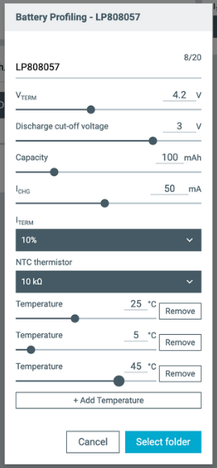
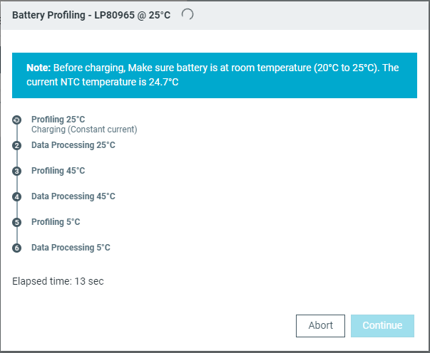

# Profiling a battery with nPM PowerUP

!!! note "Note"
     This feature is available for the nPM1300 EK and the nPM1304 EK.

Use the {{app_name}} together with the [nPM1300 Evaluation Kit (EK)](https://docs.nordicsemi.com/bundle/ug_npm1300_ek/page/UG/nPM1300_EK/intro.html) or the nPM1304 Evaluation Kit (EK) to profile your battery and generate a battery model.

## Prerequisites

Depending on the EK you are using:

* nPM1300 EK:

    * You need the [nPM Fuel Gauge Board](https://docs.nordicsemi.com/bundle/ug_npm_fuel_gauge/page/UG/nPM_fuel_gauge/intro.html) for profiling and generating the model. Connect the nPM Fuel Gauge Board to the nPM1300 EK at the edge connectors **P20** and **P21** (denoted as **EXT BOARD** on the EK). For the complete overview of the whole process, read the [Using the nPM1300 Fuel Gauge](https://docs.nordicsemi.com/bundle/nan_045/page/APP/nan_045/intro.html) application note.
    * Connect the nPM1300 EK and download the software as described in [Connect the nPM1300 EK with nPM PowerUP](https://docs.nordicsemi.com/bundle/ug_npm1300_ek/page/UG/nPM1300_EK/use_ek_power_up.html).

* nPM1304 EK:

    * The nPM Fuel Gauge Board is not required.
    * Connect the nPM1304 EK and download the software.

Once the battery model is extracted, you only need the PMIC and the SoC (or SiP) in your application to do fuel gauging.

## Profiling a battery in the {{app_name}}

Complete the following steps to profile a battery and use the generated battery model to initialize and run the fuel gauge in the {{app_name}}:

1. Click the [**Profile Battery**](overview.md#actions) button in the side panel.
1. Enter the battery data and one or more temperatures for the profiling test. Provide the generic information about the selected battery. Refer to the battery datasheet for information. For further information on profiling, see [Guidelines for battery profiling](profiling_guidelines.md).

    

1. Click **Select folder** to create a new project and store the battery model files.
1. Follow the instructions in the application to start battery profiling. 
   The following text box is displayed during battery profiling.

    

    The measurement data is automatically processed in the Nordic battery modeling software to make a single battery model file for each test temperature.

1. After the temperature profiling at a given temperature is complete, follow the instructions in the application to charge the battery at room temperature before profiling at the next test temperature. When all the individual temperature models have been completed, they are merged to generate the final battery model file. The final battery model is automatically saved as both a JSON file and an INC file.
1. Select [**Add New Active Battery Model**](./overview.md#npm1300-and-nPM1304-fuel-gauge) in the side panel. 
   A drop-down menu appears.
1. Select **Custom Model** to load the generated JSON battery model file to the host System on Chip (SoC) of nPM1300 EK.

To start fuel gauge evaluations using a battery model, see [Evaluating a battery model with nPM PowerUP](evaluating_battery.md).
