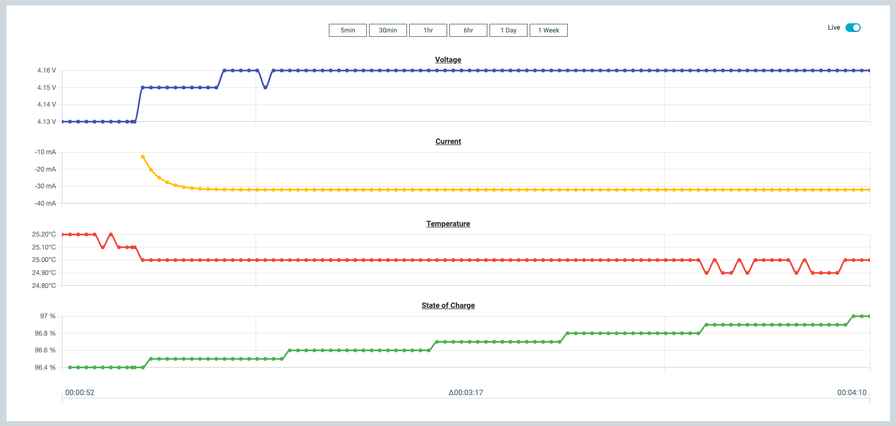

# Profiling a battery with nPM PowerUP

Use the nPM PowerUP together with the [nPM1300 Evaluation Kit (EK)](https://docs.nordicsemi.com/bundle/ug_npm1300_ek/page/UG/nPM1300_EK/intro.html) and the [nPM Fuel Gauge Board](https://docs.nordicsemi.com/bundle/ug_npm_fuel_gauge/page/UG/nPM_fuel_gauge/intro.html) to profile your battery and generate a battery model.

The EK and the nPM Fuel Gauge Board are used to profile and generate the model. Once the battery model is extracted, you only need nPM1300 and the SoC (or SiP) in your application to do fuel gauging.
For the complete overview of the whole process, read the [Using the nPM1300 Fuel Gauge](https://docs.nordicsemi.com/bundle/nan_045/page/APP/nan_045/intro.html) application note.

## Generating a battery model

Complete the following steps to profile a battery and use the generated battery model to initialize and run the nPM1300 fuel gauge in the nPM PowerUP app:

1. Connect the nPM Fuel Gauge Board to the nPM1300 Evaluation Kit (EK) at the edge connectors **P20** and **P21** (denoted as **EXT BOARD** on the EK).
1. Follow the instructions in [Connect nPM1300 EK to nPM PowerUP](https://docs.nordicsemi.com/bundle/ug_npm1300_ek/page/UG/nPM1300_EK/use_ek_power_up.html) to connect the nPM1300 EK and download the software.
1. Click the [**Profile Battery**](overview.md#actions) button in the side panel.
1. Enter the battery data and temperatures for the profiling test. Provide the generic information about the selected battery. Refer to the battery datasheet for information. For further information on profiling, see [Guidelines for battery profiling](./profiling_guidelines.md).

    

1. Click **Select folder** to create a new project and store the battery model files.
1. Follow the instructions in the application to start battery profiling. 
   The following text box is displayed during battery profiling.

    

    The measurement data is automatically processed in the Nordic battery modeling software to make a single battery model file for each test temperature.

1. After the temperature profiling at a given temperature is complete, follow the instructions in the application to charge the battery at room temperature before profiling at the next test temperature. When all the individual temperature models have been completed, they will be merged to generate the final battery model file. The final battery model is automatically saved as both a JSON file and an INC file.
1. Select [**Add New Battery Model**](./overview.md#fuel-gauge) in the side panel. 
   A drop-down menu appears.
1. Select **Custom Model** to load the generated JSON battery model file to the host System on Chip (SoC) of nPM1300 EK.

## Evaluating a battery model

To start fuel gauge evaluations using a battery model, complete the following steps:

1. Make sure the following conditions are met:

    - You have a battery connected to the EK.
    - You have an active battery model selected in the [**Fuel Gauge**](./overview.md#fuel-gauge) side panel, either using the **Active Battery Model** for a preloaded battery model or the **Add New Battery Model** > **Custom Model** for your own custom battery model from a JSON file.
    - You have the **Fuel Gauge** setting enabled on the [**Dashboard**](./overview.md#dashboard-tab) tab.

1. Open the [**Graph**](./overview.md#graph-tab) tab.
1. Make sure the **Live** toggle is enabled. 
   The graph will display the live State of Charge over time.

    

