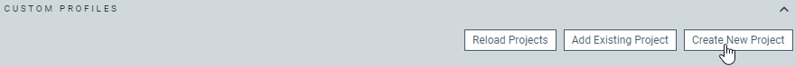
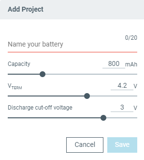
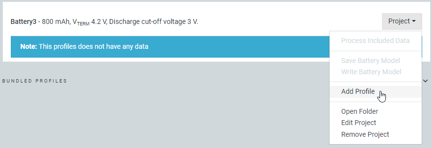
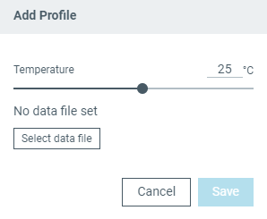
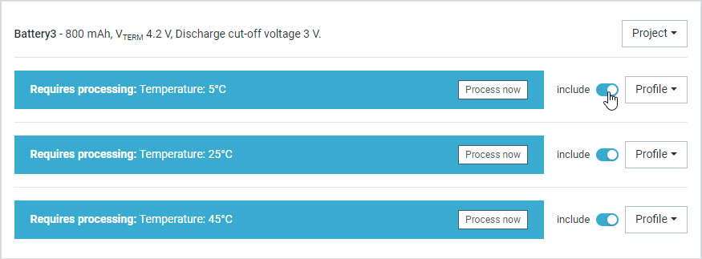
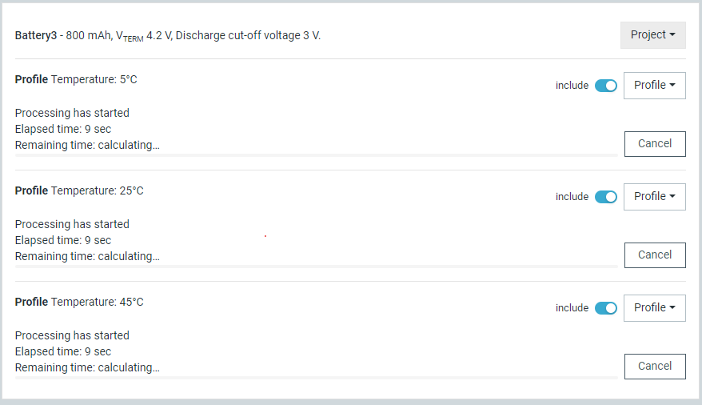
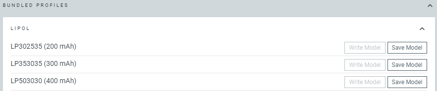

# Working with temperature profiles

The {{app_name}} comes with the [**Profiles**](overview.md#npm1300-and-npm1304-profiles-tab) tab, where you can interact with the battery profiles you create as well as with pre-profiled and generic battery models.

!!! note "Note"
     - This feature is available for the nPM1300 EK and the nPM1304 EK.
     - You cannot use profiles for the nPM1300 EK with the nPM1304 EK and vice-versa.

## Merging temperature profiles

If you [profile the battery](profiling_battery.md) at each temperature individually, the {{app_name}} creates distinct CSV files for each temperature session. You can then combine these CSV files to create a comprehensive battery model that covers all individual temperature ranges.

Complete the following steps to merge individual temperature profiles into a single battery model:

1. Make sure you have the CSV files for the temperature profiles you want to merge.
1. Open the **Profiles** tab in the {{app_name}}.
1. Click the **Create New Project** button from the custom profiles section.

    

    The **Add Project** window appears.

    

1. In the **Add Project** window, enter the name of the project and select other parameters as needed.
1. Click the **Save** button to create and save the [`profileSettings.json`](profiling_battery.md#profiling-output-files) file on your computer.
1. For each of the temperature profiles you want to merge, add the CSV data file to the project:

     1. Click the **Add Profile** button in the [**Project** drop-down menu](overview.md#project-section).

        

        The **Add Profile** window appears.

        

     1. Click the **Select data file** button to import the CSV data file for the respective temperatures into the new project.
     1. Set the **Temperature** to the temperature of the profile you are importing.
     1. Click the **Save** button to add the profile to the project.

1. After importing all temperature profiles, use the **Include** toggle for each profile to select which temperatures to include in the merged model.

    

1. In the [**Project** drop-down menu](overview.md#project-section), click the **Process Included Data** button. The {{app_name}} will analyze the data from the individual profiles and generate a single battery model by merging the profiles for each included temperature.

    

1. After processing is complete for all temperatures, save the final model by selecting **Save Battery Model** in the [**Project** drop-down menu](overview.md#project-section). The model will include all temperature-specific data and can be saved as a single [INC or JSON](profiling_battery.md#profiling-output-files) file.

## Using pre-profiled battery models

The {{app_name}} includes bundled profiles from selected vendors that have been profiled by Nordic Semiconductor. These pre-profiled battery models provide ready-to-use configurations for common battery types.

Complete the following steps to use a pre-profiled battery model:

1. Open the [**Profiles**](overview.md#npm1300-and-npm1304-profiles-tab) tab in the {{app_name}}.
1. Expand the **Bundled profiles** section.

    

1. For the battery model you want to use, click the **Save Model** button next to it to save the model to your computer in [INC](profiling_battery.md#profiling-output-files) format.
1. Configure your application to use the [nRF Fuel Gauge library](https://docs.nordicsemi.com/bundle/nrfxlib-apis-latest/page/group_nrf_fuel_gauge.html) from the nRF Connect SDK.

You can also check out the [nPM1300 and nPM1304 fuel gauge sample](https://docs.nordicsemi.com/bundle/ncs-latest/page/nrf/samples/pmic.html) for an implementation example. If you decide to use the sample, replace the default battery model used in the fuel gauge sample with the downloaded model. See the sample documentation for more information.

Once your application is ready, you can run it on your PMIC device and proceed to [evaluate the battery model](evaluating_battery.md).
